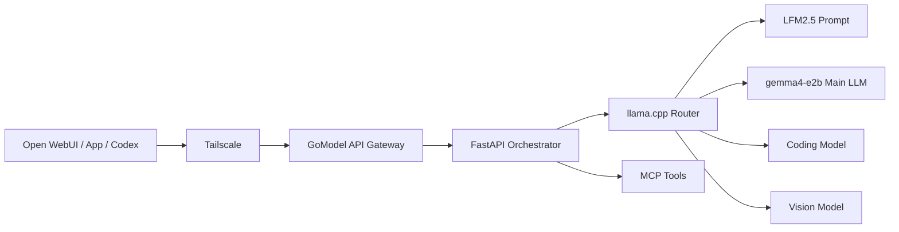

# Local LLM Orchestrator

ระบบ API ส่วนตัวสำหรับควบคุม local LLM หลายโมเดล โดยใช้ `llama.cpp` เป็น inference runtime และ FastAPI เป็น orchestration layer ระบบนี้ไม่มีหน้าแชตในตัว และออกแบบให้ต่อกับ Open WebUI, GoModel, Codex หรือ client ที่รองรับ OpenAI API

## Related Repositories

ระบบ Local AI นี้แยกเป็น repository ย่อยเพื่อให้ดูแลและนำไปใช้งานได้อย่างอิสระ:

- [local-llm-orchestrator](https://github.com/ntaffzii/local-llm-orchestrator) - เปิดและควบคุมโมเดล local, จัดการ process ของ llama.cpp, route request และให้บริการ OpenAI-compatible API
- [ai-desk-tools](https://github.com/ntaffzii/ai-desk-tools) - MCP Tools สำหรับเชื่อมโมเดลเข้ากับเครื่องมือและ workflow ภายนอก
- [Skill-Agents](https://github.com/ntaffzii/Skill-Agents) - Skills, instructions, prompts และ workflow ที่นำกลับมาใช้กับ agent ได้

```text
Open WebUI / App / Codex
          |
          v
local-llm-orchestrator
          |
          +--> Local models through llama.cpp
          |
          +--> ai-desk-tools through MCP
                     |
                     +--> Skill-Agents workflows
```

## System Flow



`llama.cpp` โหลด GGUF เข้า RAM/VRAM และทำ inference ส่วน Orchestrator เลือกโมเดล ปรับ prompt เรียก MCP และเปิด OpenAI-compatible API

## Features

- Physical models และ virtual models ผ่าน `GET /v1/models`
- OpenAI-compatible `POST /v1/chat/completions`
- Auto routing สำหรับ general, coding และ vision
- Prompt improvement ด้วย LFM2.5
- MCP tool-calling loop พร้อม allowlist และจำนวนรอบสูงสุด
- Streaming passthrough สำหรับ request ตรง
- API key, CORS allowlist, request ID, retry และ structured errors
- Health/readiness endpoints
- llama.cpp multi-model presets และการจำกัดโมเดลที่โหลดพร้อมกัน
- PowerShell scripts สำหรับ start, stop, status, health และ validation

## Model Names

| Client model | Behavior |
|---|---|
| `auto` | เลือกโมเดลและ workflow อัตโนมัติ |
| `main-llm` | ส่งตรงไป `gemma4-e2b` |
| `main-llm-improved` | LFM2.5 ปรับ prompt ก่อนเข้า main model |
| `main-llm-tools` | main model พร้อม MCP tools |
| `coding` | coding model โดยตรง |
| `coding-improved` | ปรับ prompt ก่อนเข้า coding model |
| `vision` | vision model |
| `prompt` | LFM2.5 โดยตรง |

ชื่อโมเดลและไฟล์ทั้งหมดเป็นค่าเริ่มต้น แก้ได้ใน `config/models.json` และ `config/models.ini`

## Quick Start

Requirements:

- Windows 10/11
- Python 3.11+
- llama.cpp รุ่นที่รองรับ router mode
- GGUF models ตามที่กำหนดใน `config/models.ini`

```powershell
cd local-llm
Copy-Item .env.example .env
python -m venv .venv
.\.venv\Scripts\python.exe -m pip install -r requirements-dev.txt

Set-ExecutionPolicy -Scope Process Bypass
.\scripts\validate.ps1
.\scripts\start.ps1
.\scripts\health.ps1
```

API เริ่มต้น:

```text
Orchestrator: http://127.0.0.1:8090
llama.cpp:    http://127.0.0.1:8080
API docs:     http://127.0.0.1:8090/docs
```

Docker quick start:

```powershell
Copy-Item .env.docker.example .env.docker
.\scripts\docker-validate.ps1
.\scripts\docker-up.ps1 -Build          # CPU
.\scripts\docker-up.ps1 -Cuda -Build    # NVIDIA CUDA
```

## Open WebUI / GoModel

ตั้ง OpenAI-compatible provider เป็น:

```text
Base URL: http://127.0.0.1:8090/v1
API Key:  ค่า ORCHESTRATOR_API_KEY ใน .env
```

สำหรับเครื่องนอกบ้าน ให้ GoModel หรือ Open WebUI เรียกผ่าน Tailscale และอย่าเปิดพอร์ต llama.cpp สู่ Internet โดยตรง

## Documentation

- [Architecture](docs/ARCHITECTURE.md)
- [API](docs/API.md)
- [Configuration](docs/CONFIGURATION.md)
- [Operations](docs/OPERATIONS.md)
- [Docker Deployment](docs/DOCKER.md)
- [Using Skill-Agents](docs/SKILL_AGENTS.md)
- [Complete System Guide in Skill-Agents](https://github.com/ntaffzii/Skill-Agents/blob/master/docs/COMPLETE_LOCAL_AI_SYSTEM.md)
- [Repository and Publishing](docs/REPOSITORY.md)
- [GitHub Repository Guide](docs/GITHUB.md)
- [Security](SECURITY.md)

## Test

```powershell
.\.venv\Scripts\python.exe -m pytest
```

## License

MIT
