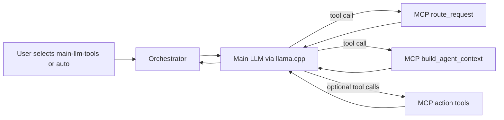

# Using Skill-Agents

Skill-Agents is an instruction and workflow layer. It is not loaded by llama.cpp directly and it does not run inference.

## Component Roles

```text
llama.cpp Router   = runs GGUF models
Orchestrator       = selects models and manages tool workflows
MCP skill-runtime  = finds and loads Skill-Agents instructions
Skill-Agents repo  = SKILL.md files, workflows and routing metadata
```

## Skill Flow



For tool-enabled requests, Orchestrator inserts a system policy telling the model to:

1. Call `route_request` for non-trivial tasks.
2. Call `build_agent_context` when it needs workflow and skill instructions.
3. Load individual skills only when needed.
4. Prefer read-only or draft-only tools.

## Start MCP on the Host

Because Orchestrator runs inside Docker, the host MCP server must listen on an interface reachable from Docker Desktop.

```powershell
cd C:\Users\natth\Documents\Skill-Agents\mcp-tools
python -m venv .venv
.\.venv\Scripts\python.exe -m pip install -r requirements.txt
.\.venv\Scripts\python.exe server_http.py `
  --transport streamable-http `
  --host 0.0.0.0 `
  --port 8765
```

Then set `.env.docker`:

```env
MCP_ENABLED=true
MCP_SERVER_URL=http://host.docker.internal:8765/mcp
MCP_TOOL_ALLOWLIST=route_request,build_agent_context,load_skill,load_workflow,list_toolsets,get_toolset
```

Restart Orchestrator:

```powershell
.\scripts\docker-down.ps1
.\scripts\docker-up.ps1 -Cuda
```

Binding MCP to `0.0.0.0` can expose it to the LAN. Use Windows Firewall to allow only Docker/WSL interfaces, do not port-forward `8765`, and keep MCP disabled until the firewall rule is understood.

## Which Model to Select

| Model | Skill behavior |
|---|---|
| `main-llm` | No Skill or MCP workflow |
| `main-llm-improved` | LFM2.5 rewrites the prompt; no Skill tools |
| `main-llm-tools` | Skill policy and MCP tools always enabled |
| `auto` | Skills/tools enabled only when tool keywords match |
| `coding` | Coding model without Skills |
| `coding-improved` | Prompt rewrite, then coding model |

Use `main-llm-tools` while validating Skill-Agents. Move to `auto` after routing behavior is satisfactory.

## Tool Allowlist

The example allowlist exposes only Skill routing and loading. That lets the model follow skills but does not let it edit files, browse, or call GitHub.

To let a skill perform work, add only the exact action tools required by that workflow. For example:

```env
MCP_TOOL_ALLOWLIST=route_request,build_agent_context,load_skill,load_workflow,list_files,read_file,repo_index
```

Avoid enabling every MCP tool. In particular, review filesystem writes, command execution, email, database mutation and external posting tools first.

## Example Conversation

Select `main-llm-tools` in Open WebUI and ask:

```text
Review this repository and propose the safest way to add an authentication endpoint. Use the relevant Skill-Agents workflow and inspect files read-only.
```

Expected sequence:

```text
route_request
-> build_agent_context
-> selected read-only tools
-> final answer following the selected skill/workflow
```

## Prompt-Only Alternative

If MCP is unavailable, use `examples/local-llm-agent-prompt.md` as the system prompt and paste only the selected Skill content. This is less dynamic than `skill-runtime` but still works with the same llama.cpp and Orchestrator services.

